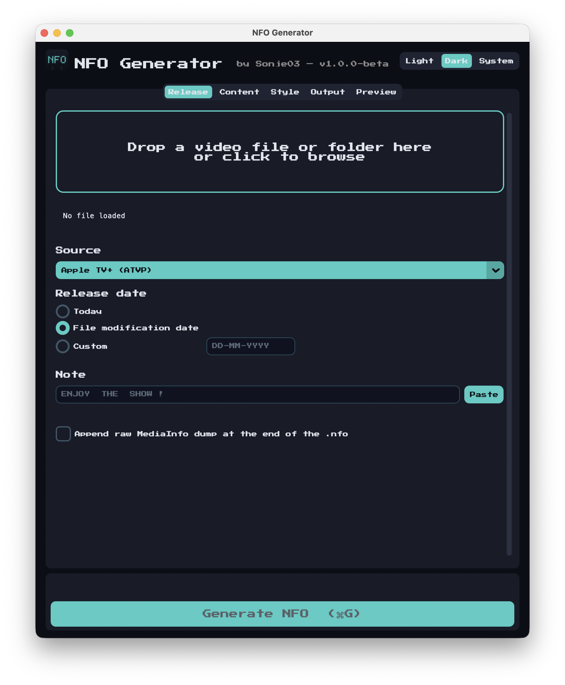
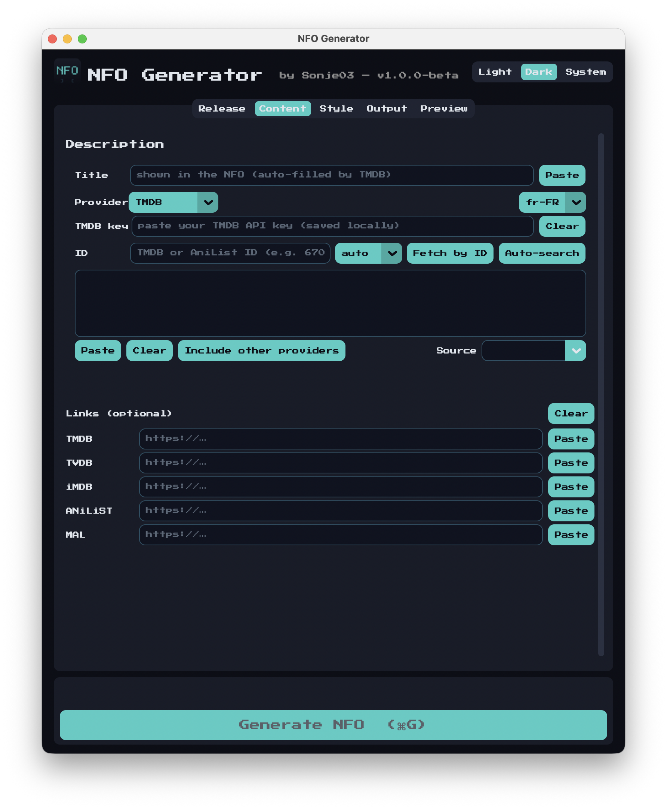
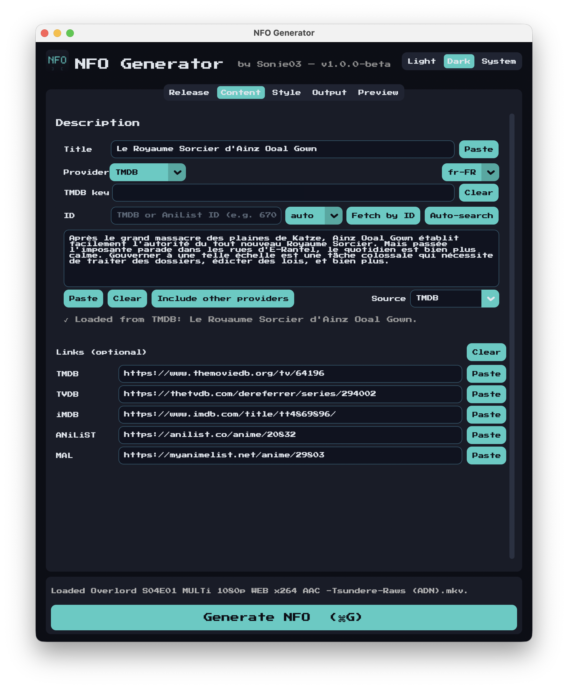
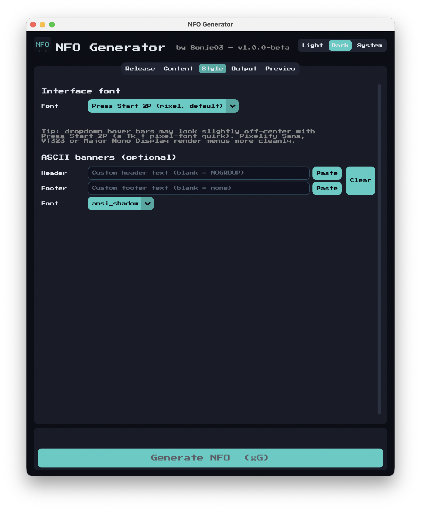
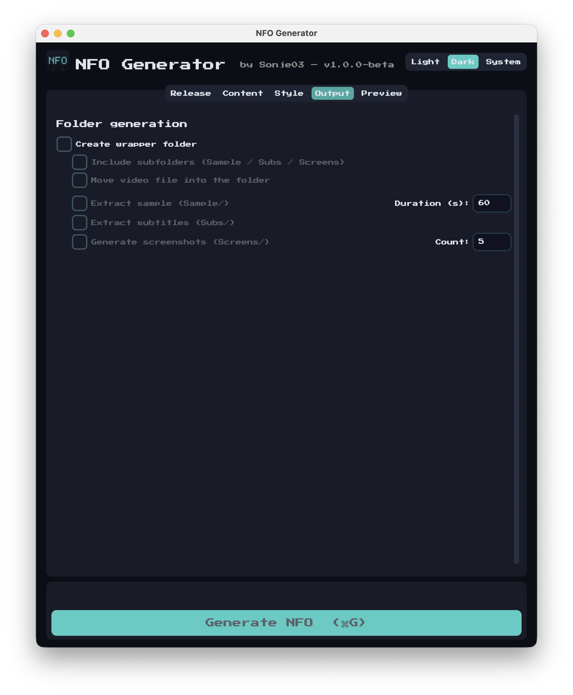
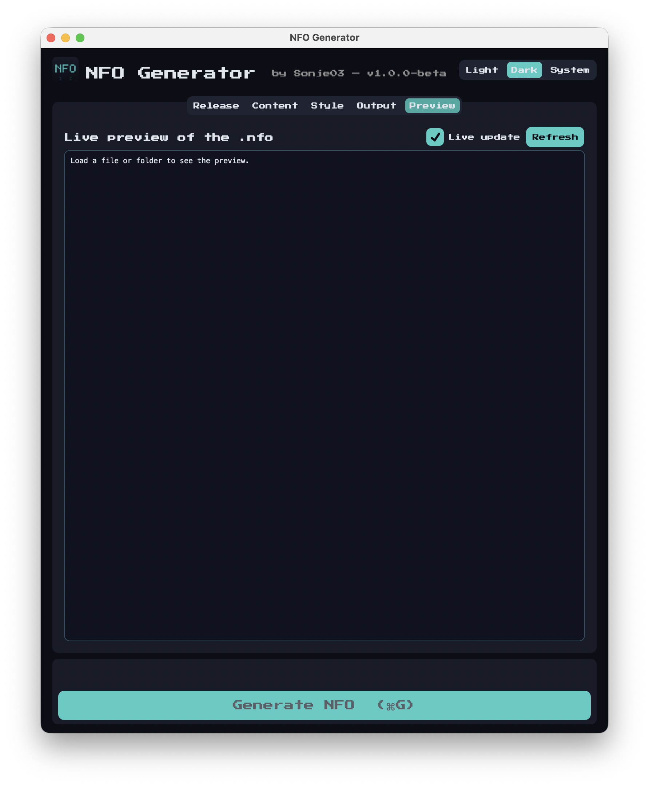
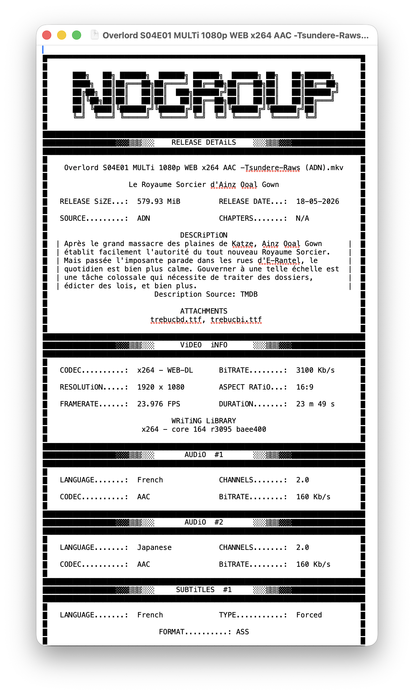

# NFO Generator

Turns a video file's MediaInfo metadata into a stylized ASCII `.nfo` file.
Drag a file in, fill a few fields, hit Generate.

```
█▀▀▀▀▀▀▀▀▀▀▀▀▀▀▀▀▀▀▀▀▀▀▀▀▀▀▀▀▀▀▀▀▀▀▀▀▀▀▀▀▀▀▀▀▀▀▀▀▀▀▀▀▀▀▀▀▀▀▀▀▀▀▀▀▀▀▀▀▀▀▀▀▀█
█                                                                         █
█       ███████  ██████  ███    ██      ██ ███████  ██████  ██████        █
█       ███████ ██    ██ ██ ██  ██      ██ █████   ██ ██ ██  █████        █
█       ███████  ██████  ██   ████  █████  ███████  ██████  ██████        █
█                                                                         █
███████████████████████████████████████████████████████████████████████████
█████████████████▓▓▓▒▒▒░░░    RELEASE DETAiLS    ░░░▒▒▒▓▓▓█████████████████
…
```

## Features

- Reads media metadata via `pymediainfo` (no subprocess, no temp XML files).
- GUI (CustomTkinter + drag & drop) or CLI.
- Correct HDR rendering for Dolby Vision + HDR10+ multi-format files.
- Source-aware codec labels (`WEB-DL`, `BluRay`, `UHD BluRay`…).
- Aspect ratio taken from MediaInfo's `Display aspect ratio` field, not
  width/height (which gives garbage like `172:93`).
- Bundled `libmediainfo` in `./lib/` and bundled ffmpeg via `imageio-ffmpeg`.
  No system install needed.

### Metadata providers

Three sources for description + cross-links:

- **TMDB** — your API key in the GUI, full episode-level synopsis when the
  filename has `SxxExx`, plus IMDb/TVDB IDs from `external_ids`.
- **AniList** — GraphQL, no key needed, fills the MAL link too.
- **TVDB v4** — key + optional PIN. Episode lookup with a defensive
  `seasonNumber`/`number` filter (the API sometimes ignores the query
  params and returns the whole list).

The **Include other providers** button hits the remaining two with the
current title and fills any empty link row. Description and title aren't
touched, and rows you typed manually aren't overwritten.

### Output

- Optional wrapper folder with `Sample/`, `Subs/`, `Screens/` populated by
  ffmpeg: stream-copied sample, every embedded subtitle track, screenshots
  with burned-in timecodes.
- Links section (TMDB / TVDB / iMDB / ANiLiST / MAL).
- Optional raw MediaInfo dump appended below the box.
- ASCII header/footer banners via pyfiglet, default `NOGROUP`.

### UI

- Custom teal/dark-navy theme matched to the icon.
- Press Start 2P as the default font. Picker with VT323, Silkscreen,
  Pixelify Sans, Major Mono Display, Share Tech Mono, JetBrains Mono,
  Aptos, SF Pro Text, Segoe UI, system monospace. Drop a TTF in
  `assets/fonts/` and it gets registered at the process level (no system
  install).
- Dark mode by default. Light/Dark/System persisted across launches.
- Live preview tab, debounced.
- Keyboard shortcuts: ⌘G generate, ⌘O open, ⌘⇧F auto-search.
- Update check at startup against GitHub releases, cached 24h, dismissible.

## Requirements

Python 3.10+. `libmediainfo` bundled in `./lib/` or available somewhere
the loader can find it (MediaInfo.app, Homebrew, system package).

## Setup

```bash
python3 -m venv venv
source venv/bin/activate          # Windows: venv\Scripts\activate
pip install -r requirements.txt
```

### libmediainfo

The loader checks several locations (`MEDIAINFO_LIB_CANDIDATES` in
`nfo_generator/core.py`). For a portable checkout, drop it into `./lib/`:

```bash
# macOS, MediaInfo.app installed:
mkdir -p lib && cp /Applications/MediaInfo.app/Contents/MacOS/libmediainfo*.dylib lib/

# macOS, Homebrew:
brew install mediainfo && cp "$(brew --prefix)/lib/libmediainfo.0.dylib" lib/

# Linux:
sudo apt-get install libmediainfo0v5
cp /usr/lib/x86_64-linux-gnu/libmediainfo.so.0 lib/
```

Windows: download MediaInfo CLI from
<https://mediaarea.net/en/MediaInfo/Download/Windows> and copy
`MediaInfo.dll` into `lib/`.

## First launch on macOS

The `.app` isn't signed with a paid Apple Developer ID, so Gatekeeper will
block it the first time. Two options:

- **Right-click the app → Open → Open anyway.** Works most of the time.
- If macOS says *"NFO Generator is damaged and can't be opened"*, run this
  once in Terminal to strip the quarantine attribute:

```bash
xattr -dr com.apple.quarantine "/Applications/NFO Generator.app"
```

After that the app launches normally.

## Screenshots
















## Usage

### GUI

```bash
python NFO_generator.py
# or:
python -m nfo_generator
```

Drag a video onto the window (or click to browse), fill in source / date /
optional note, click **Generate NFO**. Output goes next to the video as
`<release_name>.nfo`.

For provider lookup:

1. Content tab.
2. Pick TMDB / AniList / TVDB.
3. Paste the API key if needed (AniList doesn't need one).
4. Auto-search uses the filename, or type an ID and Fetch by ID.
5. After the primary fetch, Include other providers fills the remaining
   link rows.

### CLI

```bash
python NFO_generator.py --cli
python NFO_generator.py /path/to/Release.Name.x265-GROUP.mkv
```

## Roadmap

Stuff I'd like to add. Drop a 👍 on the issue to vote.

- [Batch mode](https://github.com/Sonje03/nfo-generator/issues/1) — one `.nfo` per file in a folder
- [NFO viewer](https://github.com/Sonje03/nfo-generator/issues/2) — drag an existing `.nfo` back in to edit it
- [Custom template editor](https://github.com/Sonje03/nfo-generator/issues/3) — define your own layout in the GUI
- [Provider fallback chain](https://github.com/Sonje03/nfo-generator/issues/4) — TMDB → TVDB → AniList when one is unreachable
- [Recent files history](https://github.com/Sonje03/nfo-generator/issues/5) — quick-access list of the last 10 files / folders

## Contributing

Project layout, build instructions, architecture notes and code style
are in [CONTRIBUTING.md](CONTRIBUTING.md).

## License

MIT — see [LICENSE](LICENSE).
